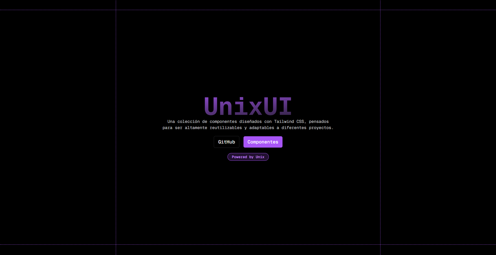

<h1 style="text-align: center; font-size: 50px; font-weight: bold;">Unix UI</h1>



## Empezar

Primero, ejecute el servidor de desarrollo:

```bash
npm run dev
# or
yarn dev
# or
pnpm dev
# or
bun dev
```

Abre [http://localhost:3000](http://localhost:3000) con tu navegador y mira el resultado.